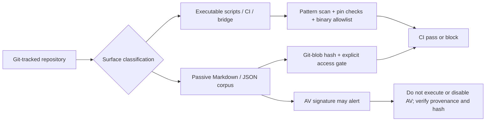

# Repository security review — 2026-09-03

## Executive summary

This review addresses GitHub Issue #125 and the Microsoft Defender detection `Backdoor:PHP/ImagePHPBackdoor.A` reported against `skills/pentest-tools/src-hunter/references/payloader/waf-bypass.md`.

The executable surface showed **no evidence of an implanted backdoor, downloader-to-shell chain, destructive root deletion, database wipe, credential collector, or executable reference to the payload corpus**. The Defender alert is consistent with static signature matching on deliberately embedded security-research strings. The strongest candidate is the file's single image/polyglot sequence at line 2322, which combines a GIF header with PHP dynamic evaluation. Without Defender engine telemetry, this is a high-confidence attribution rather than proof of the vendor's exact signature rule.

The review also found two hardening gaps and fixed them:

1. The passive/executable boundary was documented but not continuously enforced. A Git-index CI verifier now checks payload identity, binary allowlists, symlinks, dangerous executable-source patterns, payload references, and full-SHA GitHub Action pins.
2. The Gradle 8.7 Wrapper distribution lacked `distributionSha256Sum`, and the tracked wrapper JAR had no official CI validation step. Both controls are now present.

## Scope and baseline

- Repository baseline: `71acc8e3115f76bad7a914c36466c1086232288c`
- Reviewed paths: all Git-tracked objects, executable source extensions, workflows, bootstrap manifests, the Gradle Wrapper, and the complete history of the flagged payload file
- Tools: Git object plumbing, Python 3.14 SHA-256 and policy checks, repository regression scripts
- Not performed: dynamic execution of payloads; upload to third-party malware-analysis services; reverse engineering of Defender's proprietary signature database

## Evidence → Finding → Path

| Evidence | Observation | Finding | Path |
|---|---|---|---|
| E-001 | 586 tracked entries; 70 executable-source files; 1 binary-like file; 0 symlinks | F-001: no unexplained executable/binary expansion in baseline | P-001 executable surface review |
| E-002 | The only binary-like object is `gradle-wrapper.jar`, SHA-256 `2db75c40782f5e8ba1fc278a5574bab070adccb2d21ca5a6e5ed840888448046` | F-002: wrapper needs explicit provenance validation | P-002 supply-chain hardening |
| E-003 | No executable script or workflow references `waf-bypass.md` or the payloader directory | F-003: payload corpus is passive data in repository-owned execution paths | P-003 reference boundary |
| E-004 | Payload blob `fdaebd8b5b262ac05c233b7edb1b4d32e8f47fbd`, SHA-256 `0273517455962bb9908264f82e4708b31d541c91c2ec715e8032d6c1376728b5`, 173,699 bytes | F-004: corpus identity is stable and can be gated | P-003 reference boundary |
| E-005 | Blob contains two PHP `eval(base64_decode(...))` patterns and one GIF-header-plus-PHP-eval pattern | F-005: detection is plausibly signature-based | P-004 AV attribution |
| E-006 | File history has one introduction commit: `9c28c6c` (`release: v1.0.1`) | F-006: no later payload mutation was hidden in normal history | P-004 AV attribution |
| E-007 | Bootstrap pin/coherence tests and full-SHA workflow inspection pass | F-007: automatic sources are constrained by manifest and immutable workflow refs | P-002 supply-chain hardening |



## Detailed findings

### F-001 — No implanted executable malware found

The executable scan found two explainable high-signal constructs in the baseline:

- a loopback `/dev/tcp` port probe in Kali tool discovery;
- dynamic loading of selected function ASTs in a Codex encoding regression test.

The regression test now uses `ScriptBlock.Create` instead of `Invoke-Expression`, reducing ambiguous scanner signals. The TCP client and `/dev/tcp` occurrences remain allowlisted health probes with fixed source paths.

### F-002 — Payload alert attribution

The flagged file is Markdown, but signature scanners inspect byte sequences regardless of extension. Its image-header-plus-PHP-evaluation example closely resembles an image/PHP polyglot web shell, which is consistent with the reported detection family. Other nearby examples include encoded PHP evaluation and command-execution strings.

This establishes a plausible static-signature cause. It does **not** establish that every antivirus alert on every archive is a false positive; users should verify the repository origin, commit, and corpus hash and keep protection enabled.

### F-003 — Execution boundary and residual limitation

Repository-owned bootstrap, router, CI, and executable scripts do not import or execute the payloader corpus. `src-hunter` requires a granted case scope and explicit payload request before the corpus is opened.

Residual limitation: an external Agent or user can bypass repository entry scripts and invoke Nmap, an MCP server, or another tool directly. That behavior is outside the repository's technical enforcement boundary. Client permissions, sandboxing, MCP registration, and target authorization remain required controls.

### F-004 — Supply-chain controls

- GitHub Actions are pinned to full commit SHAs.
- Auto-install sources are constrained by `bootstrap-manifest.json` and the existing pin gate.
- MCP host registration is opt-in and client-specific configuration is not written by default.
- Binary Ninja and other commercial applications remain manual dependencies.
- Gradle 8.7 now uses official distribution SHA-256 `544c35d6bd849ae8a5ed0bcea39ba677dc40f49df7d1835561582da2009b961d`.
- CI uses Gradle's official wrapper validation action pinned to commit `9c971963bec38e04b3d30dcc455b5382be2fdbfb` (v6.3.0).

## Reproduction

```powershell
python skills/scripts/verify-repository-security.py
python skills/scripts/verify-doc-links.py
powershell -NoProfile -ExecutionPolicy Bypass -File skills/scripts/verify-routing-coherence.ps1
powershell -NoProfile -ExecutionPolicy Bypass -File skills/scripts/smoke.ps1
```

Inspect the quarantined payload without requiring a working-tree copy:

```powershell
git rev-parse "HEAD:skills/pentest-tools/src-hunter/references/payloader/waf-bypass.md"
git log --follow -- skills/pentest-tools/src-hunter/references/payloader/waf-bypass.md
```

## Disposition

- Keep the payload corpus as explicit, passive research data.
- Do not auto-load it during routing or bootstrap.
- Block unreviewed hash changes in CI.
- Keep antivirus enabled and use Git-object inspection when a working-tree checkout is quarantined.
- Re-run this review whenever the payload hash, executable allowlist, external installer sources, or MCP execution boundary changes.
